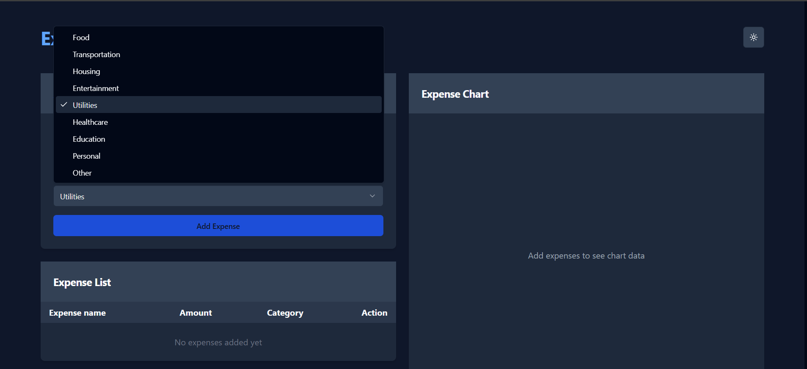
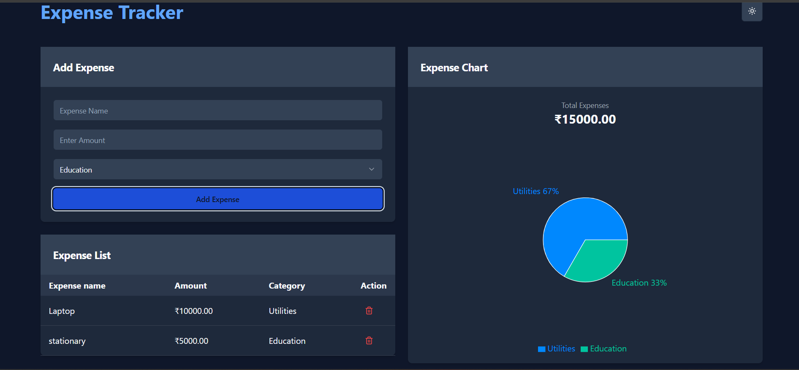
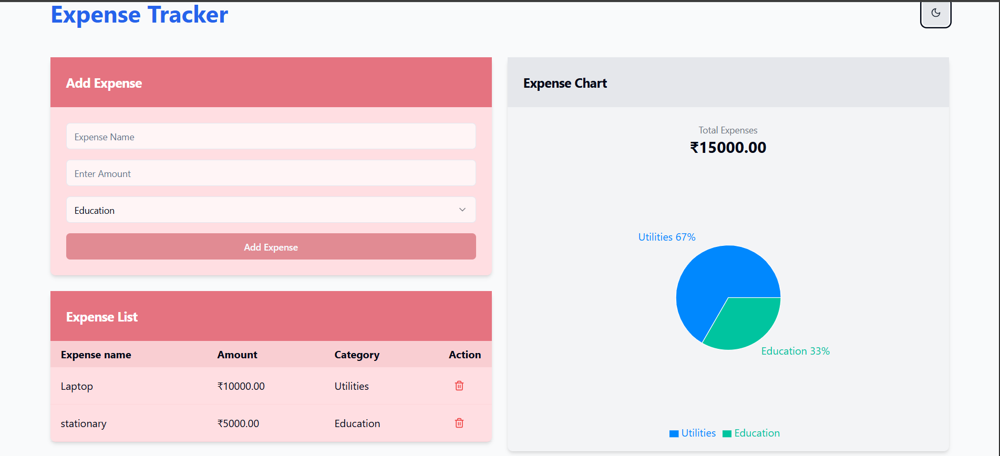

# 💸 Web Expense Tracker

**Web Expense Tracker** is a simple, intuitive, and fully responsive web application that helps users keep track of their daily expenses. You can add, view, and delete expense entries with a real-time running balance.

🌐 **Live App**: [expense-tracker176.netlify.app](https://expense-tracker176.netlify.app/)

---

## 🔑 Features

- ➕ Add new expenses with category, amount, and description
- 🗑️ Delete expenses
- 📊 See running total balance
- 🧑‍💻 Responsive UI for desktop and mobile

---

## 🚀 Tech Stack

- **Frontend**: React.js, Tailwind CSS
- **Backend**: Firebase Auth & Firestore
- **Routing**: React Router
- **Deployment**: Netlify

---

## 📸 Screenshots


### ➕ Add Expense


### 📋 Expense List




---

## 📁 Folder Structure

```bash
web-expense-tracker/
├── public/
├── src/
│   ├── components/
│   ├── context/
│   ├── pages/
│   ├── firebase.js
│   ├── App.jsx
│   ├── main.jsx
├── .gitignore
├── index.html
├── tailwind.config.js
├── package.json
└── README.md
